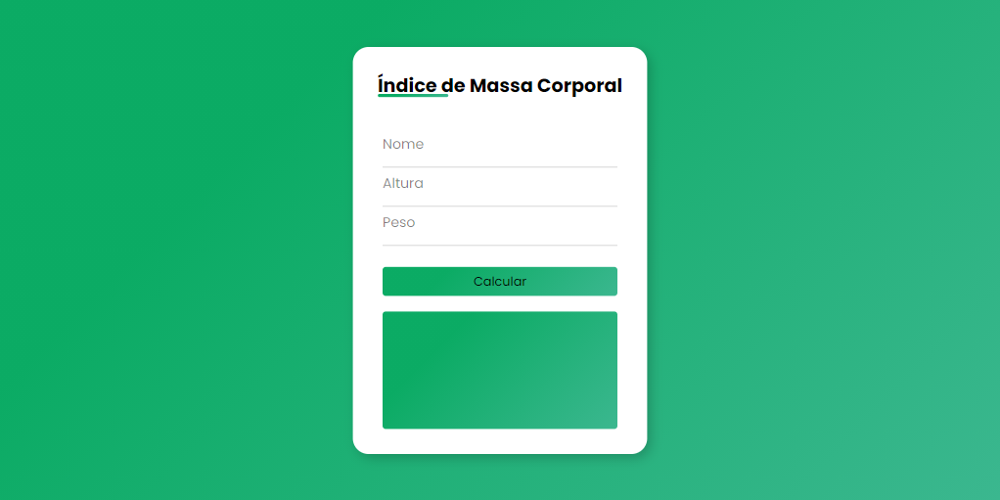

### Cálculo de IMC
---

Projeto simples utilizando HTML5, CSS3 com Flexbox e JavaScript.

Para iniciar o projeto, basta abrir o arquivo `index.html` no navegador de sua preferência.

---

Coded by **Nycole Mendonça dos Santos** 👸🏾